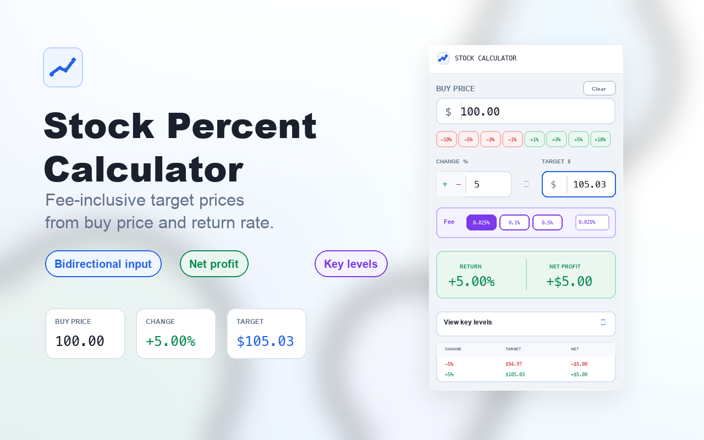

# Stock Percent Calculator

수수료를 포함한 주식 목표가와 수익률을 빠르게 계산하는 Chrome 확장 프로그램입니다.

매수가와 목표 수익률을 입력하면 수수료가 반영된 목표가를 계산하고, 반대로 목표가를 입력하면 실제 수익률을 계산합니다. 입력값은 Chrome 로컬 스토리지에 저장되어 팝업을 다시 열어도 유지됩니다.


## 스크린샷



## 주요 기능

- 매수가 기준 목표 수익률 계산
- 목표가 기준 실제 수익률 역산
- 상승/하락 방향 전환
- `-10%`, `-5%`, `-3%`, `-1%`, `+1%`, `+3%`, `+5%`, `+10%` 빠른 선택
- 기본 수수료 `0.025%` 및 수수료 프리셋 지원
- 사용자 지정 수수료 입력
- 수수료 반영 순수익 표시
- 주요 등락률별 목표가/변동액/순수익 표 제공
- 입력값 자동 저장 및 초기화

## 설치 방법

1. Chrome에서 `chrome://extensions`로 이동합니다.
2. 우측 상단의 **개발자 모드**를 켭니다.
3. **압축해제된 확장 프로그램을 로드합니다**를 클릭합니다.
4. 이 프로젝트 폴더를 선택합니다.
5. 브라우저 툴바에서 **Stock Percent Calculator** 아이콘을 클릭합니다.

## 사용 방법

1. `Buy Price`에 매수가를 입력합니다.
2. `Change`에 원하는 수익률을 입력하거나 빠른 선택 버튼을 누릅니다.
3. 계산된 `Target` 목표가와 `Net Profit` 순수익을 확인합니다.
4. 목표가를 직접 입력하면 `Change`가 자동으로 역산됩니다.
5. `Fee`에서 수수료율을 선택하거나 직접 입력합니다.
6. `View key levels`를 열면 주요 등락률별 목표가를 확인할 수 있습니다.
7. `Clear` 버튼을 누르면 입력값과 저장된 값이 초기화됩니다.

## 계산 방식

수익률을 입력한 경우:

```text
목표가 = 매수가 * (1 + (수익률 + 방향별 수수료율) / 100)
```

목표가를 입력한 경우:

```text
표시 수익률 = ((목표가 - 매수가) / 매수가 * 100) - 방향별 수수료율
```

순수익은 목표가와 매수가의 차액에서 매수가 기준 수수료 금액을 반영해 표시합니다.

## 프로젝트 구조

```text
.
├── manifest.json        # Chrome extension manifest v3 설정
├── popup.html           # 확장 팝업 UI
├── popup.css            # 팝업 스타일
├── popup.js             # 계산, 저장, 이벤트 처리 로직
├── icon16.png           # 확장 아이콘
├── icon48.png
├── icon128.png
├── store-assets/        # README 및 Chrome Web Store용 이미지
│   ├── marquee-promo-tile-1400x560.png
│   ├── screenshot-1280x800.png
│   └── small-promo-tile-440x280.png
└── test/
    └── popup.test.mjs   # Node 기반 동작 테스트
```

## 테스트

별도 패키지 설치 없이 Node.js로 테스트를 실행할 수 있습니다.

```bash
node test/popup.test.mjs
```

테스트는 팝업 HTML 구조, manifest 권한, 계산 로직, 저장/복원, 초기화 동작을 확인합니다.

## 권한

이 확장 프로그램은 다음 Chrome 권한만 사용합니다.

- `storage`: 마지막 입력값, 수익률 방향, 수수료 설정을 로컬에 저장합니다.

## 기술 스택

- Chrome Extension Manifest V3
- HTML
- CSS
- Vanilla JavaScript
- Node.js 내장 테스트 실행 환경
